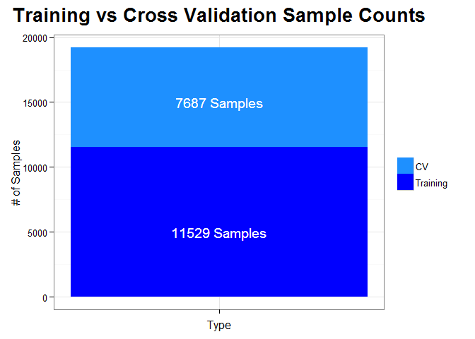
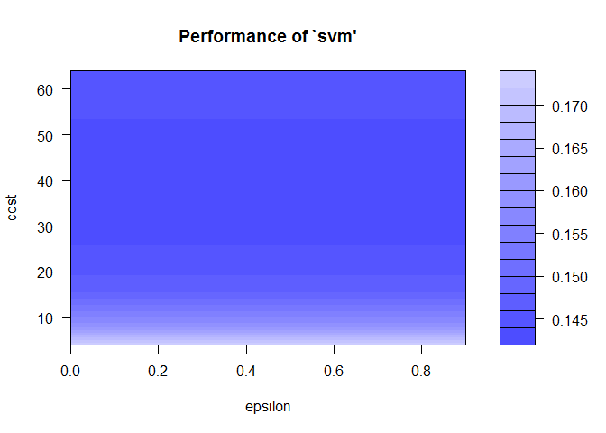

# Human Activity Recognition: Predicting Proper Excersie Technique
August 15, 2015  

#### Kory Becker - August 15, 2015

## Synopsis

This report analyzes a human activity recognition data-set, consisting of recordings from devices such as Jawbone Up, Nike FuelBand, and Fitbit self-monitoring equipment. The recordings include both proper and inproper weight-lifting routines. By analyzing an initial training set, we can predict proper versus improper weight-lifting technique with a cross-validation rating of 99.5% accuracy.

## Data Processing

The data source for the analysis is the Groupware Technologies Human Activity Recognition. The data consists of both a [training](https://d396qusza40orc.cloudfront.net/predmachlearn/pml-training.csv) and [test](https://d396qusza40orc.cloudfront.net/predmachlearn/pml-testing.csv) data-set.

We'll begin by including the following required libraries for processing data. Specifically, we'll use the nnet neural network library, and the e1071 support vector machine (SVM) library.


```r
## Including the required R packages.
packages <- c('nnet', 'e1071', 'ggplot2', 'reshape2')
if (length(setdiff(packages, rownames(installed.packages()))) > 0) {
  install.packages(setdiff(packages, rownames(installed.packages())))  
}

library(nnet)
library(e1071)
library(ggplot2)
library(reshape2)
```

We'll also include a function for creating a tidy data-set from the original training and test data. The tidy process includes the following actions:

1. Remove rows with new_window == 'yes'. These rows coorespond to summary information for a group of records and will not be required for training the model.

2. Remove the entire new_window column. Since the column now only contains a single factor value of 'no', we can strip the column to avoid data errors.

3. Remove columns (60) that contain all NA values. These coorespond to summary information from new_window == 'yes', and will not be considered within our model.

4. For training, randomize the rows. This ensures proper learning across all possible classes. For testing, rows are left in order.

5. Split the data into 2 portions: 60% training, 40% cross-validation.


```r
tidy <- function(url, isTraining = TRUE) {
  # Download training data, if it does not exist.
  fileName <- basename(url);
  if (!file.exists(fileName)) {
    download.file(url, fileName, method='curl')
  }
  
  # Read csv file.
  data <- read.csv(fileName, na.strings=c('', 'NA'), stringsAsFactors=TRUE)
  
  # Remove rows with new_window == 'yes' (about 406 rows), as these contain summary information.
  data2 <- data[data$new_window == 'no', ]
  data2$new_window <- NULL
  
  # Remove columns (about 60) with all NA values.
  data3 <- data2[, colSums(is.na(data2)) < nrow(data2)]
  
  if (isTraining == TRUE) {
    # Randomize the rows for training and cross-validation.
    data3 <- data3[sample(nrow(data3)), ]
  }
  
  # Split into training 60% and cross-validation 40% set.
  training <- head(data3, nrow(data3) * .6)
  cv <- tail(data3, nrow(data3) * .4)

  list(training, cv)
}
```

## Training and Cross-Validation Data Sets

Using our tidy method and associated data processing rules, we can now load the training and cross-validation set with the following code. Our training set will consist of 60% of the data, while the cross-validation set will consist of 40% of the data.


```r
# Create tidy training and cross-validation set.
t <- tidy('https://d396qusza40orc.cloudfront.net/predmachlearn/pml-training.csv')
training <- t[[1]]
cv <- t[[2]]
```


```
## [1] "Training rows: 11529"
```

```
## [1] "CV rows: 7687"
```

 

*Figure 1. Sample counts for training versus cross-validation sets. The initial training data-set is split 60/40 to allow for in-sample and out-of-sample results.*

## Analysis Model 1: Neural Network

Our first analysis will utilize a neural network to attempt to model the data. By using differing numbers of neurons in the hidden layer, we can control bias and variance. The larger the number of hidden neurons, the larger the variance, and potential exists for overfitting. More neurons also increases training time. It is therefore important to limit the hidden layer size, according to the data.

Our neural network consists of 52 input nodes, one for each usable column in the training set, and 5 output nodes. The output nodes dictate the classification (the node with the highest value relates the classification).


```r
# Analysis 1: Create neural network model on training set. Input: 5 nodes, Hidden: 8 nodes, Output: 1 node.
#mod1 <- nnet(classe ~ . - num_window - cvtd_timestamp - raw_timestamp_part_1 - raw_timestamp_part_2 - user_name - X, data = training, maxit = 10000, size = 12)

# Predict results of nnet on training.
#training$y1 <- predict(mod1, training, type='class')
#trainError <- sum(training$classe != training$y1) / nrow(training)
#trainAccuracy <- 1 - trainError

# Predict results of nnet on cv.
#cv$y1 <- predict(mod1, cv, type='class')
#cvError <- sum(cv$classe != cv$y1) / nrow(cv)
#cvAccuracy <- 1 - cvError
```

## Analysis Model 2: Support Vector Machine (SVM)

Our second analysis uses a support vector machine to model the data. We begin by determining the optimal settings for the SVM. Specifically, we'll configure the cost and gamma variables, which indicate how closely to fit the data with regard to bias and variance.

We use the tune method to perform an SVM grid search on a small subset of the training data. This runs the SVM using a range of values for cost and gamma. The best fitting values can be used to run on the entire training set. We limit the training data used in the tuning to a small number of rows, as this process can consume a considerate amount of time (multiple SVMs are trained within a loop).


```r
# Analysis 2: SVM
# First, determine optimal svm settings by doing an SVM grid search on a subset of the training data (doing a grid search on the full training set would take too long). epsilon = from 0 to 1, step 0.3. cost = 2^2, 2^3 ... 2^6.
tuneResult <- tune(svm, classe ~ . - num_window - cvtd_timestamp - raw_timestamp_part_1 - raw_timestamp_part_2 - user_name - X, data = head(training, 1000), ranges = list(epsilon = seq(0,1,0.3), cost = 2^(2:6)))

# Get the best svm and take its cost and gamma values to run on the full training data set.
tunedModel <- tuneResult$best.model
cost <- tuneResult$best.model$cost
gamma <- tuneResult$best.model$gamma
```


```
## [1] "Optimal cost: 64"
```

```
## [1] "Optimal gamma: 0.0192307692307692"
```

Once our tuning is complete, we can visualize the results. Although the best.model property allows us to automatically access the optimal SVM settings, it is useful to view a map of the resulting models.


```r
plot(tuneResult)
```

 

*Figure 2. A visualization of the SVM tuning process. Darker colors indicate a better fit and are likely to result in a more accurate model.*

We can now create an SVM with the optimized settings and train our model.


```r
# Create an svm model on training set.
mod2 <- svm(classe ~ . - num_window - cvtd_timestamp - raw_timestamp_part_1 - raw_timestamp_part_2 - user_name - X, training, cost = cost, gamma = gamma)

# Predict results of svm on training.
training$y2 <- predict(mod2, training)
trainError <- sum(training$classe != training$y2) / nrow(training)
trainAccuracy <- 1 - trainError

# Predict results of svm on cv.
cv$y2 <- predict(mod2, cv)
cvError <- sum(cv$classe != cv$y2) / nrow(cv)
cvAccuracy <- 1 - cvError
```

In-sample Results

```
## [1] "Training Error: 0.00199496920808396"
```

```
## [1] "Training Accuracy: 0.998005030791916"
```

Out-of-sample Results

```
## [1] "CV Error: 0.00533368023936516"
```

```
## [1] "CV Accuracy: 0.994666319760635"
```

The results appear to be a very good fit with a high accuracy for both the training and cross-validation sets. Note, the cross-validation set consists of data that was not used within the actual training of the model.

We can now run the SVM model on the test set and obtain the results.


```r
# Create tidy test set.
t <- tidy('https://d396qusza40orc.cloudfront.net/predmachlearn/pml-testing.csv', FALSE)
test <- t[[1]]
test <- rbind(test, t[[2]])

# Predict results of svm on test.
test$y <- predict(mod2, test)

# Display result.
test$y
```

```
##  [1] B A B A A E D B A A B C B A E E A B B B
## Levels: A B C D E
```


## Sources

1. Groupware Technologies Human Activity Recognition *[[link]](http://groupware.les.inf.puc-rio.br/har)

2. Velloso, E.; Bulling, A.; Gellersen, H.; Ugulino, W.; Fuks, H. Qualitative Activity Recognition of Weight Lifting Exercises. Proceedings of 4th International Conference in Cooperation with SIGCHI (Augmented Human '13). Stuttgart, Germany: ACM SIGCHI, 2013. *[[link]](http://groupware.les.inf.puc-rio.br/work.jsf?p1=11201)*

3. Qualitative Activity Recognition of Weight Lifting Exercises *[[link]](http://groupware.les.inf.puc-rio.br/public/papers/2013.Velloso.QAR-WLE.pdf)*
