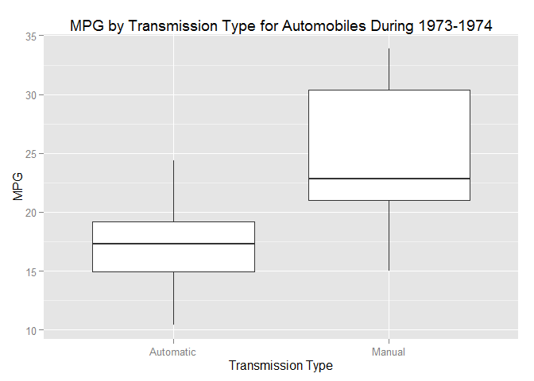
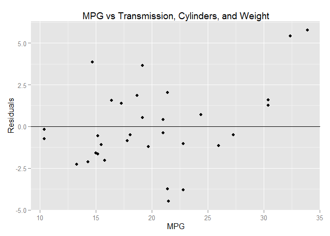

# Automotive Analysis of Transmission vs MPG
July 15, 2015  

## Executive Summary

This report analyzes the relationship between mpg and type of transmission. It was found that manual transmissions achieve the highest mpg efficiency, even while considering both number of cylinders and automobile weight. The most optimal model is a 4-cylinder manual transmission, resulting in the highest mpg efficency.

## Data Processing

The data source for the analysis is the "mtcars" data set, extracted from the 1974 Motor Trend US magazine.


```r
## Including the required R packages.
packages <- c("ggplot2", "ggthemes", "reshape2")
if (length(setdiff(packages, rownames(installed.packages()))) > 0) {
  install.packages(setdiff(packages, rownames(installed.packages())))  
}
# 
library(ggplot2)
library(reshape2)
library(ggthemes)

# Include the mtcars dataset.
data(mtcars)
```

The data set contains 11 columns, of which two are directly relevant for our analysis. They are "Miles Per Gallon" and "Transmission". As we'll later show, we'll also consider "Number of Cylinders" and "Weight" in our analysis.


```r
# Create factors for key columns.
mtcars$am2 <- factor(mtcars$am)
levels(mtcars$am2) <- c('Automatic', 'Manual')
mtcars$cyl2 <- factor(mtcars$cyl)

# Re-display data.
head(mtcars)
```

```
##                    mpg cyl disp  hp drat    wt  qsec vs am gear carb
## Mazda RX4         21.0   6  160 110 3.90 2.620 16.46  0  1    4    4
## Mazda RX4 Wag     21.0   6  160 110 3.90 2.875 17.02  0  1    4    4
## Datsun 710        22.8   4  108  93 3.85 2.320 18.61  1  1    4    1
## Hornet 4 Drive    21.4   6  258 110 3.08 3.215 19.44  1  0    3    1
## Hornet Sportabout 18.7   8  360 175 3.15 3.440 17.02  0  0    3    2
## Valiant           18.1   6  225 105 2.76 3.460 20.22  1  0    3    1
##                         am2 cyl2
## Mazda RX4            Manual    6
## Mazda RX4 Wag        Manual    6
## Datsun 710           Manual    4
## Hornet 4 Drive    Automatic    6
## Hornet Sportabout Automatic    8
## Valiant           Automatic    6
```

## Model Selection

For model selection, we analyze the direct relationship between miles-per-gallon and transmission type (automatic and manual).

An initial plot of the mpg vs transmission data displays automatic transmissions ranging from 15 to 18 with a mean of 17.15, while manual averages from 21 to 30 with a mean of 24.39. There is a visible difference between mpg for automatic versus manual, with manual transmissions achieving the upper range. See Figure 1.


```r
# Display the mpg vs am data as a boxplot.
g <- ggplot(mtcars, aes(x = am2, y = mpg))
g <- g + geom_boxplot()
g <- g + ggtitle('MPG by Transmission Type for Automobiles During 1973-1974')
g <- g + xlab('Transmission Type')
g <- g + ylab('MPG')
```

We can obtain a more detailed view of the actual data points in the samples by plotting the points across the transmission type, and overlaying a linear model to highlight the trend. The predicted mpg for automatic is the mean of 17.15, while the predicted mpg for manual is its mean of 24.39.


```r
# Create a linear model for mpg (outcome) and am (predictor).
fit <- lm(mpg ~ am, mtcars)

m1 <- mean(mtcars[mtcars$am2 == 'Automatic',] $mpg)
m2 <- mean(mtcars[mtcars$am2 == 'Manual',] $mpg)

# Predict mpg from model for automatic and manual.
p <- predict(fit, newdata = data.frame(am = c(0, 1)))

# Verify prediction matches mean.
round(m1, 2) == round(p[1], 2)
round(m2, 2) == round(p[2], 2)

# Display the mpg vs am data.
g <- ggplot(mtcars, aes(x = am, y = mpg))
g <- g + geom_point()
g <- g + geom_abline(intercept = coef(fit)[1], slope = coef(fit)[2], colour = 'red')
g <- g + ggtitle('MPG by Transmission Type for Automobiles During 1973-1974')
g <- g + xlab('Transmission Type')
g <- g + ylab('MPG')
```

## Multiple Models and Exploratory Analysis

By analyzing the coefficients in the linear model, it can be found that the transmission type is statistically significant when compared with the mpg. The model shows that we expect an increase of 7.25 mpg for manual vs automatic.


```r
coef(summary(fit))
anova(fit)

# Display the model's prediction for average mpg for automatic and manual.
predict(fit, newdata = data.frame(am = c(0, 1)))
```

However, there may be other important factors that impact mpg and transmission. We can determine which factors may be significant by creating a linear model of all regressors in the data set and checking their significance.


```r
anova(lm(mpg ~ ., mtcars))
```

```
## Analysis of Variance Table
## 
## Response: mpg
##           Df Sum Sq Mean Sq  F value   Pr(>F)    
## cyl        1 817.71  817.71 122.6660 5.53e-10 ***
## disp       1  37.59   37.59   5.6395 0.027678 *  
## hp         1   9.37    9.37   1.4057 0.249660    
## drat       1  16.47   16.47   2.4703 0.131703    
## wt         1  77.48   77.48  11.6222 0.002782 ** 
## qsec       1   3.95    3.95   0.5924 0.450473    
## vs         1   0.13    0.13   0.0195 0.890432    
## am         1  14.47   14.47   2.1713 0.156173    
## gear       1   0.97    0.97   0.1458 0.706640    
## carb       1   0.41    0.41   0.0610 0.807432    
## cyl2       1  14.17   14.17   2.1258 0.160362    
## Residuals 20 133.32    6.67                      
## ---
## Signif. codes:  0 '***' 0.001 '**' 0.01 '*' 0.05 '.' 0.1 ' ' 1
```

The resulting data indicates that the statistically significant regressors with regard to mpg include Number of Cylinders, Displacement, and Weight. We can compare residual plots to determine which combination offers the closest model for the data.

## Residual Plots

The first residual plot displays a close correlation and non-random pattern between transmission type and mpg. After adding Number of Cylinders to the model, the correlation begins to appear more random. A final residual plot that includes mpg, transmission, cylinders, and weight displays a random pattern, indicating the linear model is an appropriate fit. See Figure 2.


```r
res <- resid(fit)

g <- ggplot(mtcars, aes(x = mpg, y = res))
g <- g + geom_point()
g <- g + geom_abline(aes(intercept = 0, slope = 0))
g <- g + ggtitle('MPG vs Transmission Residual Plot')
g <- g + xlab('MPG')
g <- g + ylab('Residuals')
```


```r
# Create a linear model for mpg (outcome) and am + cyl (predictors).
fit2 <- lm(mpg ~ am + cyl2, mtcars)
# Create a linear model for mpg (outcome) and am + cyl + wt (predictors).
fit3 <- lm(mpg ~ am + cyl2 + wt, mtcars)

# Determine statistical significance.
summary(fit2)
summary(fit3)

# Obtain residuals.
res <- resid(fit3)

# Plot residuals against mpg.
g <- ggplot(mtcars, aes(x = mpg, y = res))
g <- g + geom_point()
g <- g + geom_abline(aes(intercept = 0, slope = 0))
g <- g + ggtitle('MPG vs Transmission and Cylinders Residual Plot')
g <- g + xlab('MPG')
g <- g + ylab('Residuals')
```

After including transmission, cylinder, and weight in the model we note the following values. Manual transmission increases mpg by only 0.15, 6-cylinders decreases mpg by -4.26, while 8-cylinders decreases mpg by -6.08. Weight decreases mpg by -3.15. By including weight, transmission type is no longer statistically signficant and manual vs automatic makes little difference.

Since our focus is on transmission type, we can settle on a final model of transmission and cylinder count. Manual transmission increases mpg by 2.56. 6-cylinders decreases mpg by -6.16, while 8-cylinders decreases mpg by -10.07.

## Is an automatic or manual transmission better for MPG?

As shown in Figure 3, we can determine that manual transmission is better for mpg. We can predict from our model of mpg vs transmission + cylinders the following results: A 4-cylinder automobile will achieve 24.80 and 27.36 mpg for automatic and manual respectively, while 6-cylinders will achieve 18.65 and 21.21 mpg, and 8-cylinders 14.73 and 17.29 mpg respectively.


```r
# Predict the mpg for automatic, manual and 4-cylinder cars.
round(predict(fit2, newdata = data.frame(am = c(0, 1), cyl2 = c('4', '4'))), 2)
```

```
##     1     2 
## 24.80 27.36
```

```r
# Predict the mpg for automatic, manual and 6-cylinder cars.
round(predict(fit2, newdata = data.frame(am = c(0, 1), cyl2 = c('6', '6'))), 2)
```

```
##     1     2 
## 18.65 21.21
```

```r
# Predict the mpg for automatic, manual and 8-cylinder cars.
round(predict(fit2, newdata = data.frame(am = c(0, 1), cyl2 = c('8', '8'))), 2)
```

```
##     1     2 
## 14.73 17.29
```

```r
# Predict the mpg for automatic, manual, 4-cylinder cars, weight 5.
round(predict(fit3, newdata = data.frame(am = c(0, 1), cyl2 = c('4', '4'), wt = c(5, 5))), 2)
```

```
##     1     2 
## 18.01 18.16
```

```r
# Predict the mpg for automatic, manual and 6-cylinder cars, weight 5.
round(predict(fit3, newdata = data.frame(am = c(0, 1), cyl2 = c('6', '6'), wt = c(5, 5))), 2)
```

```
##     1     2 
## 13.75 13.90
```

```r
# Predict the mpg for automatic, manual and 8-cylinder cars, weight 5.
round(predict(fit3, newdata = data.frame(am = c(0, 1), cyl2 = c('8', '8'), wt = c(5, 5))), 2)
```

```
##     1     2 
## 11.93 12.08
```

## What is the MPG difference between automatic and manual transmissions?

Based upon our initial model of mpg vs transmission, we can expect a 7.25 mpg increase in manual vs automatic transmission. When considering number of cylinders, we expect a 2.56 mpg increase for manual vs automatic, and upon including weight, we expect a 0.15 mpg increase for manual transmissions.


```r
coef(fit)
```

```
## (Intercept)          am 
##   17.147368    7.244939
```

```r
coef(fit2)
```

```
## (Intercept)          am       cyl26       cyl28 
##   24.801852    2.559954   -6.156118  -10.067560
```

```r
coef(fit3)
```

```
## (Intercept)          am       cyl26       cyl28          wt 
##  33.7535920   0.1501031  -4.2573185  -6.0791189  -3.1495978
```

## Conclusion

In this analysis, we've determined that there is an overall trend of manual transmission achieving higher mpg efficiency than automatic transmissions. This effect is less for higher cylinder and higher weight cars, but holds effect nonetheless. The most optimal combination is a 4-cycliner manual transmission.

## Appendix


```r
# Display the mpg vs am data as a boxplot.
g <- ggplot(mtcars, aes(x = am2, y = mpg))
g <- g + geom_boxplot()
g <- g + ggtitle('MPG by Transmission Type for Automobiles During 1973-1974')
g <- g + xlab('Transmission Type')
g <- g + ylab('MPG')

print(g)
```

 

*Figure 1. This chart displays the difference in MPG by transmission type. Manual transmissions generally achieve higher values for MPG than automatic, with a clear separation around 23 MPG.*


```r
# Create a linear model for mpg (outcome) and am (predictor).
fit2 <- lm(mpg ~ am + cyl2 + wt, mtcars)

res <- resid(fit2)

g <- ggplot(mtcars, aes(x = mpg, y = res))
g <- g + geom_point()
g <- g + geom_abline(aes(intercept = 0, slope = 0))
g <- g + ggtitle('MPG vs Transmission, Cylinders, and Weight')
g <- g + xlab('MPG')
g <- g + ylab('Residuals')

print(g)
```

 

*Figure 2. A residual plot of the linear model for mpg, transmission type, number of cylinders, and weight.*


```r
# Display the mpg vs am data.
g <- ggplot(mtcars, aes(x = am, y = mpg))
g <- g + geom_point(aes(color = cyl2, size = cyl2))
g <- g + geom_smooth(aes(color=cyl2), method = "lm", se = TRUE)
g <- g + scale_color_manual(values = c("black", "orange", "red"))
g <- g + ggtitle('MPG by Transmission and # Cylinders')
g <- g + xlab('Transmission Type')
g <- g + ylab('MPG')

print(g)
```

 

*Figure 3. The linear model shows that the highest rates of MPG are achieved by 4-cylinder engines with manual transmissions.*
