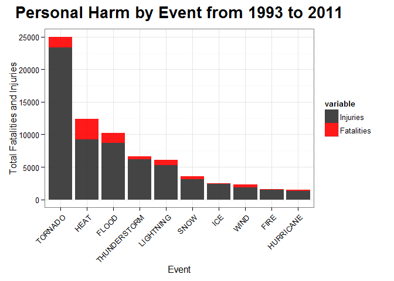
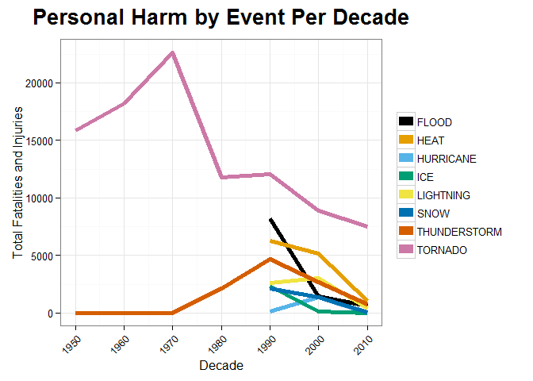
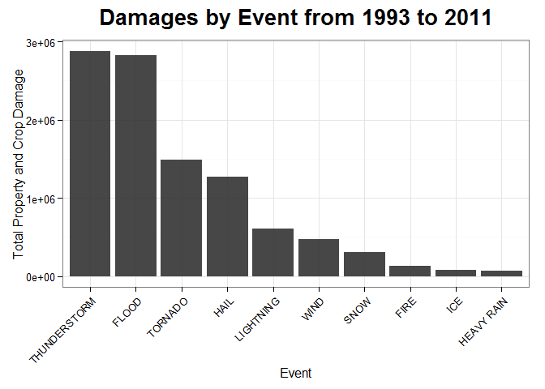

# Reproducible Research: Peer Assessment 2

An Analysis of the Most Harmful Weather Events and Economic Impact From 1993 to 2011
---

Kory Becker - June 15, 2015

## Synopsis

Severe weather events can result in significant harm to both the population and the economy. This report analyzes the U.S. National Oceanic and Atmospheric Administration's (NOAA) storm database, which contains thousands of weather events, recorded over the time period of 1950 to 2011. As a result of the analysis, it is determined that the top most harmful weather events, over the period of time, consists of tornadoes, heat waves, and flooding. It is also determined that weather events with the highest economical impact include thunderstorms, flooding, and tornadoes. Through the awareness of severe weather impact on the population and economy, we can have enhanced insight into protecting the public and increasing well-being. 


## Data Processing

The data source for this analysis is the U.S. National Oceanic and Atmospheric Administration's (NOAA) storm [database](https://d396qusza40orc.cloudfront.net/repdata%2Fdata%2FStormData.csv.bz2).

Before loading the data, we include the following libraries for processing.


```r
## Including the required R packages.
packages <- c("ggplot2", "ggthemes", "reshape2")
if (length(setdiff(packages, rownames(installed.packages()))) > 0) {
  install.packages(setdiff(packages, rownames(installed.packages())))  
}
# 
library(ggplot2)
library(reshape2)
library(ggthemes)
```

The following helper methods have also been created, to assist in processing the data.


```r
multiplyDamage <- function(value, multiplier) {
  # Function for calculating true property/crop damage by factoring in multiplier. Example: 1.5 M => 1500000.
  result <- NULL
  
  multiplier <- toupper(multiplier)
  
  if (multiplier == 'K') {
    result <- value * 1000
  }
  else if (multiplier == 'M') {
    result <- value * 1000000
  }
  else if (multiplier == 'B') {
    result <- value * 1000000000
  }
  else {
    result <- value
  }
  
  result
}

orderGroupsByEvent <- function(data, groupColumnName1, groupColumnName2) {
  # Transforms a data.frame into a sorted data.frame, grouped by Event Type (where event types will appear in order). Useful for plotting charts of top 10 event types.

  # Transform data into long-style, for usage with stacked bar chart (injuries + fatalities).
  p <- melt(data, id.vars = 'Event')
  p <- p[p$variable != 'Total',]
  p <- p[order(p$value, decreasing = TRUE), ]
  
  # Split into groups by event name, to allow sorting by event type in order by total count.
  p1 <- split(p, p$Event)
  
  # Reshape the groups to include Index, Event, Total.
  p2 <- sapply(seq_along(p1), function(t) {
    c(Index = t, Event = names(p1[t]), Total = sum(p1[[t]]$value))
  })
  
  # Sort the groups by total in descending order.
  p3 <- p2[, order(as.numeric(p2['Total',]), decreasing=TRUE)]
  
  # Create a new data.frame with the groups as rows (grouped together by event name) in descending order by total count.
  p4 <- data.frame(Event = character(), variable = character(), Total = numeric())
  
  # Loop through set and append rows of groups. This allows us to plot a bar chart in histogram form.
  for (i in 1:ncol(p3)) {
    row <- p3[, i]
    
    originalRow <- p[p$Event == p3[, i]['Event'],]
    
    newRow1 <- data.frame(Event = row[['Event']], variable = groupColumnName1, Total = originalRow[originalRow$variable == groupColumnName1,]['value'])
    names(newRow1) <- c('Event', 'variable', 'Total')
    
    newRow2 <- data.frame(Event = row[['Event']], variable = groupColumnName2, Total = originalRow[originalRow$variable == groupColumnName2,]['value'])
    names(newRow2) <- c('Event', 'variable', 'Total')
    
    p4 <- rbind(p4, newRow2)
    p4 <- rbind(p4, newRow1)
  }
  
  p4
}
```

### Downloading and Cleaning the Data

The data is downloaded directly from the source and loaded into memory. Once complete, we begin filtering the data to clean event types and assign each weather event into a designated category.

Simple regular expressions are used to clean event types. In general, we remove adjectives, such as "UNSEASONABLE", "EXTREME", "DEEP", and similar descriptive words. This allows us to filter down to the core weather event category.

Plural terms are resolved to their singular form. For example, "FLOODING" and "FLOODS" are both converted to simply "FLOOD". Similarly, "HOT", "HEAT", "WARM" are converted to "HEAT".

The following code sample shows the cleaning process in detail, including a final list of the unique event types.


```r
# Download dataset, if it does not exist.
fileName <- 'repdata-data-StormData.csv.bz2';
if (!file.exists(fileName)) {
  download.file('https://d396qusza40orc.cloudfront.net/repdata%2Fdata%2FStormData.csv.bz2', fileName, method="curl")
}

# Read csv file.
data <- read.csv(fileName)

# EVTYPE contains many variations of the same event name.
# Convert to all upper-case.
data$EVTYPE <- toupper(data$EVTYPE)

# Add a date column by parsing the BGN_DATE field and converting to a date type.
dateFormat <- "%m/%d/%Y %H:%M:%S"
data$date <- as.Date(data$BGN_DATE, dateFormat)

# Add a year column
data$year <- format(data$date, '%Y')

# Add a decade column by rounding the year down to the nearest 10.
data$decade <- floor(as.numeric(format(data$date, "%Y")) / 10) * 10

# Remove event types containing: SUMMARY, TEMPERATURE RECORD.
data <- data[!grepl("SUMMARY", data$EVTYPE), ]
data <- data[!grepl("TEMPERATURE RECORD", data$EVTYPE), ]

# Replace anything other than [A-Z] with space.
data$EVTYPE <- gsub('[^a-zA-Z]', ' ', data$EVTYPE)

# Replace AND with space.
data$EVTYPE <- gsub('AND', ' ', data$EVTYPE)
data$EVTYPE <- gsub('UNSEASONABLE', ' ', data$EVTYPE)
data$EVTYPE <- gsub('UNSEASONABLY', ' ', data$EVTYPE)
data$EVTYPE <- gsub('SEVERE', ' ', data$EVTYPE)
data$EVTYPE <- gsub('PROLONG', ' ', data$EVTYPE)
data$EVTYPE <- gsub('PROLONGED', ' ', data$EVTYPE)
data$EVTYPE <- gsub('EXPOSURE', ' ', data$EVTYPE)
data$EVTYPE <- gsub('EXCESSIVE', ' ', data$EVTYPE)
data$EVTYPE <- gsub('EXTREME', ' ', data$EVTYPE)
data$EVTYPE <- gsub('EXTREMELY', ' ', data$EVTYPE)
data$EVTYPE <- gsub('EARLY', ' ', data$EVTYPE)
data$EVTYPE <- gsub('DEEP', ' ', data$EVTYPE)
data$EVTYPE <- gsub('ABNORMALLY', ' ', data$EVTYPE)
data$EVTYPE <- gsub('ABNORMAL', ' ', data$EVTYPE)
data$EVTYPE <- gsub('STRONG', ' ', data$EVTYPE)
data$EVTYPE <- gsub('STORM FORCE', ' ', data$EVTYPE)
data$EVTYPE <- gsub('RECORD', ' ', data$EVTYPE)
data$EVTYPE <- gsub('FIRST', ' ', data$EVTYPE)
data$EVTYPE <- gsub('DENSE', ' ', data$EVTYPE)
data$EVTYPE <- gsub('EROSIN', 'EROSION', data$EVTYPE)
data$EVTYPE <- gsub('AVALANCE', 'AVALANCHE', data$EVTYPE)
data$EVTYPE <- gsub('COASTALSTORM', 'COASTAL STORM', data$EVTYPE)

# Remove double-spaces.
data$EVTYPE <- gsub('[ ]{2,}', ' ', data$EVTYPE)

# Rename abbreviations: SML=>SMALL, FLDG=>FLOOD, FLOODING=>FLOOD, FLOODS => FLOOD, FLOODIN => FLOOD, FLD=>FLOOD, WARMTH=>WARM, COOL=>COLD, WND=>WIND, FIRES=>FIRE, WILD FIRES=>WILDFIRE, WILDFIRES=>WILDFIRE, VOG=>FOG
data$EVTYPE <- gsub('SML', 'SMALL', data$EVTYPE)
data$EVTYPE <- gsub('HURRICANE.*', 'HURRICANE', data$EVTYPE)
data$EVTYPE <- gsub('FLDG|FLOODING|FLOODS|FLOODIN|FLD', 'FLOOD', data$EVTYPE)
data$EVTYPE <- gsub('.+FLOOD.*', 'FLOOD', data$EVTYPE)
data$EVTYPE <- gsub('WARMTH', 'WARM', data$EVTYPE)
data$EVTYPE <- gsub('COOL|LOW TEMPERATURE', 'COLD', data$EVTYPE)
data$EVTYPE <- gsub('WND', 'WIND', data$EVTYPE)
data$EVTYPE <- gsub('FIRES|.+FIRE|FIRE WX', 'FIRE', data$EVTYPE)
data$EVTYPE <- gsub('WILD FIRE|WILD FIRES|WILD FIRE|WILDFIRES|WILD FOREST FIRE', 'WILDFIRE', data$EVTYPE)
data$EVTYPE <- gsub('VOG', 'FOG', data$EVTYPE)
data$EVTYPE <- gsub('WATERSPOUT .+|WATERSPOUTS|WAYTERSPOUT|WATER SPOUT', 'WATERSPOUT', data$EVTYPE)
data$EVTYPE <- gsub('WET MONTH|WET YEAR|WET MICROBURST|WET MICOBURST|WET SNOW|WET WEATHER|WETNESS', 'WET', data$EVTYPE)
data$EVTYPE <- gsub('WIND .+|WINDS|HIGH WIND.*', 'WIND', data$EVTYPE)
data$EVTYPE <- gsub('VOLCANIC ASH.+', 'VOLCANIC ASH', data$EVTYPE)
data$EVTYPE <- gsub('THUNDER.+|THUNDEER.+|TUNDER.*|TSTM.*|THUNERSTORM.*|THUNDESTORM.*|THUDERSTORM.*', 'THUNDERSTORM', data$EVTYPE)
data$EVTYPE <- gsub('STORM SURGE.+', 'STORM SURGE', data$EVTYPE)
data$EVTYPE <- gsub('SNOW.+|.+SNOW.*|WINTER.*|WINTRY.*', 'SNOW', data$EVTYPE)
data$EVTYPE <- gsub('SLEET.+', 'SLEET', data$EVTYPE)
data$EVTYPE <- gsub('RIP CURRENT.+', 'RIP CURRENT', data$EVTYPE)
data$EVTYPE <- gsub('RAIN.+', 'RAIN', data$EVTYPE)
data$EVTYPE <- gsub('MUDSLIDE.*|MUD SLIDE.*|MUD ROCK.*', 'MUDSLIDE', data$EVTYPE)
data$EVTYPE <- gsub('MARINE.+', 'MARINE', data$EVTYPE)
data$EVTYPE <- gsub('LIGHTNING.+', 'LIGHTNING', data$EVTYPE)
data$EVTYPE <- gsub('ICE.+|ICY.+|GLAZE.*|BLACK ICE', 'ICE', data$EVTYPE)
data$EVTYPE <- gsub('HOT.*|HEAT.*|WARM.*', 'HEAT', data$EVTYPE)
data$EVTYPE <- gsub('TORNADO.*', 'TORNADO', data$EVTYPE)
data$EVTYPE <- gsub('DRY.*', 'DRY', data$EVTYPE)
data$EVTYPE <- gsub('COLD.*', 'COLD', data$EVTYPE)
data$EVTYPE <- gsub('BLIZZARD.*', 'BLIZZARD', data$EVTYPE)
data$EVTYPE <- gsub('TROPICAL STORM.*', 'TROPICAL STORM', data$EVTYPE)
data$EVTYPE <- gsub('HAIL.*', 'HAIL', data$EVTYPE)

# Trim the event names of whitespace.
data$EVTYPE <- gsub('^\\s+|\\s+$', '', data$EVTYPE)

# Set the EVTYPE to a factor.
data$EVTYPE <- factor(data$EVTYPE)

# Display the unique event types.
levels(data$EVTYPE)
```

```
##   [1] ""                           "AGRICULTURAL FREEZE"       
##   [3] "APACHE COUNTY"              "ASTRONOMICAL HIGH TIDE"    
##   [5] "ASTRONOMICAL LOW TIDE"      "AVALANCHE"                 
##   [7] "BEACH EROSION"              "BELOW NORMAL PRECIPITATION"
##   [9] "BITTER WIND"                "BLIZZARD"                  
##  [11] "BLOW OUT TIDE"              "BLOW OUT TIDES"            
##  [13] "BLOWING DUST"               "COASTAL EROSION"           
##  [15] "COASTAL STORM"              "COASTAL SURGE"             
##  [17] "COLD"                       "DAM BREAK"                 
##  [19] "DAM FAILURE"                "DAMAGING FREEZE"           
##  [21] "DOWNBURST"                  "DOWNBURST WIND"            
##  [23] "DRIEST MONTH"               "DROUGHT"                   
##  [25] "DROUGHT HEAT"               "DROWNING"                  
##  [27] "DRY"                        "DUST DEVEL"                
##  [29] "DUST DEVIL"                 "DUST DEVIL WATERSPOUT"     
##  [31] "DUST STORM"                 "DUST STORM WIND"           
##  [33] "DUSTSTORM"                  "ED RAIN"                   
##  [35] "EXTENDED COLD"              "FIRE"                      
##  [37] "FIRE WX"                    "FIRES"                     
##  [39] "FLASH FLOOODING"            "FLOOD"                     
##  [41] "FLOOD FLASH"                "FLOOD HEAVY RAIN"          
##  [43] "FLOOD RAIN"                 "FLOOD WATCH"               
##  [45] "FLOOD WIND"                 "FOG"                       
##  [47] "FOG COLD"                   "FREEZE"                    
##  [49] "FREEZING DRIZZLE"           "FREEZING DRIZZLE FREEZING" 
##  [51] "FREEZING FOG"               "FREEZING RAIN"             
##  [53] "FREEZING SPRAY"             "FROST"                     
##  [55] "FROST FREEZE"               "FUNNEL"                    
##  [57] "FUNNEL CLOUD"               "FUNNEL CLOUD HAIL"         
##  [59] "FUNNEL CLOUDS"              "FUNNELS"                   
##  [61] "GRADIENT WIND"              "GROUND BLIZZARD"           
##  [63] "GUSTNADO"                   "GUSTY LAKE WIND"           
##  [65] "GUSTY THUNDERSTORM"         "GUSTY WIND"                
##  [67] "HAIL"                       "HARD FREEZE"               
##  [69] "HAZARDOUS SURF"             "HEAT"                      
##  [71] "HEAVY MIX"                  "HEAVY PRECIPATATION"       
##  [73] "HEAVY PRECIPITATION"        "HEAVY RAIN"                
##  [75] "HEAVY SEAS"                 "HEAVY SHOWER"              
##  [77] "HEAVY SHOWERS"              "HEAVY SURF"                
##  [79] "HEAVY SURF HIGH SURF"       "HEAVY SURF WIND"           
##  [81] "HEAVY SWELLS"               "HEAVY WET"                 
##  [83] "HIGH"                       "HIGH SEAS"                 
##  [85] "HIGH SURF"                  "HIGH SURF ADVISORIES"      
##  [87] "HIGH SURF ADVISORY"         "HIGH SWELLS"               
##  [89] "HIGH TEMPERATURE"           "HIGH TEMPERATURES"         
##  [91] "HIGH TIDES"                 "HIGH WATER"                
##  [93] "HIGH WAVES"                 "HURRICANE"                 
##  [95] "HVY RAIN"                   "HYPERTHERMIA"              
##  [97] "HYPOTHERMIA"                "ICE"                       
##  [99] "L SLIDE"                    "L SLIDES"                  
## [101] "L SLUMP"                    "L SPOUT"                   
## [103] "LARGE WALL CLOUD"           "LATE FREEZE"               
## [105] "LATE SEASON HAIL"           "LIGHT FREEZING RAIN"       
## [107] "LIGHTING"                   "LIGHTNING"                 
## [109] "LIGNTNING"                  "LOCALLY HEAVY RAIN"        
## [111] "LOW"                        "LOW RAIN"                  
## [113] "LOW WIND"                   "LY DRY"                    
## [115] "LY WET"                     "MARINE"                    
## [117] "METRO STORM MAY"            "MICROBURST"                
## [119] "MICROBURST WIND"            "MILD DRY"                  
## [121] "MILD PATTERN"               "MIXED PRECIP"              
## [123] "MIXED PRECIPITATION"        "MONTHLY PRECIPITATION"     
## [125] "MONTHLY RAIN"               "MONTHLY TEMPERATURE"       
## [127] "MUDSLIDE"                   "NO WEATHER"                
## [129] "NON HAIL"                   "NON THUNDERSTORM"          
## [131] "NON WIND"                   "NONE"                      
## [133] "NORMAL PRECIPITATION"       "NORTHERN LIGHTS"           
## [135] "OTHER"                      "PATCHY FOG"                
## [137] "PATCHY ICE"                 "PRECIPITATION"             
## [139] "RAIN"                       "RAPIDLY RISING WATER"      
## [141] "RED FLAG CRITERIA"          "REMNANTS OF FLOYD"         
## [143] "RIP CURRENT"                "ROCK SLIDE"                
## [145] "ROGUE WAVE"                 "ROTATING WALL CLOUD"       
## [147] "ROUGH SEAS"                 "ROUGH SURF"                
## [149] "SAHARAN DUST"               "SEICHE"                    
## [151] "SLEET"                      "SMALL HAIL"                
## [153] "SMALL STREAM"               "SMOKE"                     
## [155] "SNOW"                       "SOUTHEAST"                 
## [157] "STORM SURGE"                "TEMPERATURE"               
## [159] "TEMPERATURES"               "THUNDERSTORM"              
## [161] "TORNADO"                    "TORNDAO"                   
## [163] "TORRENTIAL RAIN"            "TROPICAL DEPRESSION"       
## [165] "TROPICAL STORM"             "TSUNAMI"                   
## [167] "TURBULENCE"                 "TYPHOON"                   
## [169] "UNSEASONAL LOW TEMP"        "UNSEASONAL RAIN"           
## [171] "UNUSUAL HEAT"               "UNUSUALLY COLD"            
## [173] "UNUSUALLY HEAT"             "URBAN SMALL"               
## [175] "URBAN SMALL STREAM"         "VERY DRY"                  
## [177] "VERY HEAT"                  "VOLCANIC ASH"              
## [179] "VOLCANIC ERUPTION"          "WAKE LOW WIND"             
## [181] "WALL CLOUD"                 "WALL CLOUD FUNNEL CLOUD"   
## [183] "WATERSPOUT"                 "WET"                       
## [185] "WHIRLWIND"                  "WIND"                      
## [187] "WINDCHILL"                  "WINDCHILL TEMPERATURES"
```

## Results

### Across the United States, which types of events are most harmful with respect to population health?

The top most harmful weather events to the population are determined by first, filtering the data to the timeframe of 1993 to 2011. This is done to eliminate incomplete data in prior years, which consists largely of tornado and thunderstorm data. Due to the recording of these weather events during those early years, the total results of the data (over all years) would be skewd in favor of these events. We therefore filter the years to the range where the majority of weather events were recorded.


```r
# Filter the dataset to records starting at 1993 and later (due to missing data in prior years, which would skew results towards Tornado and Thunderstorm being over-represented while calculating total numbers across years).
data1993 <- data[data$year >= 1993,]

# Calculate the total fatalities per event type.
fatalities <- aggregate(FATALITIES ~ EVTYPE, data1993, FUN=sum)

# Calculate the total injuries per event type.
injuries <- aggregate(INJURIES ~ EVTYPE, data1993, FUN=sum)

# Create a tidy dataset of just the Event Type, Number of Fatalaties, Number of Injuries, and total number of fatalities + injuries.
personalHarm <- data.frame(Event = fatalities$EVTYPE, Fatalities = fatalities$FATALITIES, Injuries = injuries$INJURIES, Total = fatalities$FATALITIES + injuries$INJURIES)

# Sort dataset by Total, grouped by event type.
personalHarmSorted <- orderGroupsByEvent(personalHarm, 'Fatalities', 'Injuries')

# Draw bar chart.
g <- ggplot(personalHarmSorted[1:20,], aes(x = Event, y = Total, fill = variable))
g <- g + geom_bar(alpha=I(.9), stat='identity')
g <- g + ggtitle('Personal Harm by Event from 1993 to 2011')
g <- g + theme_bw()
g <- g + theme(plot.title = element_text(size=20, face="bold", vjust=2), axis.text.x = element_text(angle = 45, hjust = 1))
g <- g + xlab('Event')
g <- g + ylab('Total Fatalities and Injuries')
g <- g + scale_fill_manual(values=c('#303030', 'red'))

print(g)
```

 

As shown in the above bar chart, the most harmful weather event for the population over the years of 1993 to 2011 included: Tornadoes, Heat, and Floods. Note, the chart includes the total sum of both injuries and fatalities over the time period.

Tornadoes are, by far, the most harmful weather event to the population. Tornadoes are unpredictible, powerful, and can occur with little warning.

As the analysis shows, tornadoes have the highest injury count. However, "heat" results in the highest number of fatalities, as shown in the red bars.

## Are the most harmful weather events causing more or less damage over time?

The initial analysis of the most harmful weather events omitted a large portion of data from prior years, in order to prevent skewing the data. However, it is interesting to examine the data by decade, across all years. This allows us to gauge the overall trend and population effect of several weather events over time.


```r
# Calculate the total fatalities per event type and per decade.
fatalitiesByDecade <- aggregate(FATALITIES ~ EVTYPE + decade, data, FUN=sum)

# Calculate the total injuries per event type.
injuriesByDecade <- aggregate(INJURIES ~ EVTYPE + decade, data, FUN=sum)

# Create a tidy dataset of fatalities, injuries, and total by decade.
personalHarmByDecade <- data.frame(Event = fatalitiesByDecade$EVTYPE, Fatalities = fatalitiesByDecade$FATALITIES, Injuries = injuriesByDecade$INJURIES, Decade = fatalitiesByDecade$decade, Total = fatalitiesByDecade$FATALITIES + injuriesByDecade$INJURIES)

# Sort the tidy dataset by total count.
personalHarmByDecadeSorted <- personalHarmByDecade[order(personalHarmByDecade$Total, decreasing = TRUE),]

# Filter list to only those with top 10 highest total count, from previous chart.
personalHarmByDecadeTop <- personalHarmByDecade[personalHarmByDecade$Event %in% personalHarmByDecadeSorted[1:20, 'Event'],]

# Draw time-series chart of fatalities + injuries by decade.
g <- ggplot(personalHarmByDecadeTop, aes(x = Decade, y = Total))
g <- g + geom_line(aes(color = personalHarmByDecadeTop$Event), group = personalHarmByDecadeTop$Event, size=2)
g <- g + ggtitle('Personal Harm by Event Per Decade')
g <- g + theme_bw()
g <- g + theme(plot.title = element_text(size=20, face="bold", vjust=2), axis.text.x = element_text(angle = 45, hjust = 1), legend.title=element_blank())
g <- g + xlab('Decade')
g <- g + ylab('Total Fatalities and Injuries')
g <- g + scale_x_continuous(breaks=seq(from = 1950, to = 2010, by = 10))
g <- g + guides(colour = guide_legend(override.aes = list(size=4)))
g <- g + scale_colour_colorblind()

print(g)
```

 

The above time-series chart shows the top 8 most harmful events by decade. Notice, we include data from all available years. This is reflected in Tornado (purple) and Thunderstorm (orange) displaying values prior to 1990, while all other weather events begin at 1990.

As the time-series plot corroborates, tornadoes continue to be the most harmful of severe weather events, both in the past and current. There is a significant spike in tornado injury and fatalities during the 1960's, leading up to 1970. At this point, the count drops dramatically. This may be due to technological improvements in tornado warning systems and public protection. This trend continues downward, likely with the advent of computing technologies to aid in early detection.

Note, all of the harmful weather events included in the chart contain a downward trend, likely resulting from improvements in technologies, radar, early warning systems, and construction improvements.

## Across the United States, which types of events have the greatest economic consequences?

The severe weather events with the greatest economical impact can be determined by examining the property damage and crop damage totals for each event. We, again, filter from the years 1993 to 2011, in order to remove data that may skew the results. We then compute the sum of the property and crop damage for each event over time, as follows:


```r
# Calculate the property damage by multiplying PROPDMG by PROPDMGEXP.
propertyDamage <- aggregate(multiplyDamage(PROPDMG, PROPDMGEXP) ~ EVTYPE, data1993, FUN=sum)
```

```
## Warning in if (multiplier == "K") {: the condition has length > 1 and only
## the first element will be used
```

```
## Warning in if (multiplier == "M") {: the condition has length > 1 and only
## the first element will be used
```

```
## Warning in if (multiplier == "B") {: the condition has length > 1 and only
## the first element will be used
```

```r
names(propertyDamage)[2] <- 'Cost'

# Calculate the crop damage by multiplying CROPDMG by CROPDMGEXP.
cropDamage <- aggregate(multiplyDamage(CROPDMG, CROPDMGEXP) ~ EVTYPE, data1993, FUN=sum)
```

```
## Warning in if (multiplier == "K") {: the condition has length > 1 and only
## the first element will be used
```

```
## Warning in if (multiplier == "M") {: the condition has length > 1 and only
## the first element will be used
```

```
## Warning in if (multiplier == "B") {: the condition has length > 1 and only
## the first element will be used
```

```r
names(cropDamage)[2] <- 'Cost'

# Create a tidy dataset of just the Event Type, Property Damage, Crop Damage, and total property + crop damage.
damages <- data.frame(Event = propertyDamage$EVTYPE, Property = propertyDamage$Cost, Crop = cropDamage$Cost, Total = propertyDamage$Cost + cropDamage$Cost)

# Sort by total count in decreasing order.
damages <- damages[order(damages$Total, decreasing = TRUE),]

# Sort dataset by Total, grouped by event type.
damagesSorted <- orderGroupsByEvent(damages, 'Property', 'Crop')

# Draw bar chart.
g <- ggplot(damagesSorted[1:20,], aes(x = Event, y = Total)) #, fill = variable (omit since crop damage is too small compared to property)
g <- g + geom_bar(alpha=I(.9), stat='identity')
g <- g + ggtitle('Damages by Event from 1993 to 2011')
g <- g + theme_bw()
g <- g + theme(plot.title = element_text(size=20, face="bold", vjust=2), axis.text.x = element_text(angle = 45, hjust = 1))
g <- g + xlab('Event')
g <- g + ylab('Total Property and Crop Damage')

print(g)
```

 

As shown in the above chart, Thunderstorms results in the highest economical impact. Thunderstorms can be widespread, frequent, and cause significant damages. Flooding is the second most severe weather event, and is often a result of thunderstorms, hurricanes, typhoons, and other severe rain events.

Conclusion

Through the analysis of the U.S. National Oceanic and Atmospheric Administration's (NOAA) storm database, we've determined that the top most harmful weather events to the population, from the years 1993 to 2011, include tornadoes, heat, and floods.

The weather events with the greatest economical impact to property and crop damage, include thunderstorms, flooding, and tornadoes.

While several weather events continue to impact the population, the analysis shows that the general trend of these harmful weather events is on a downward slope over time. This offers a positive reflection to the future management of these severe weather events.
